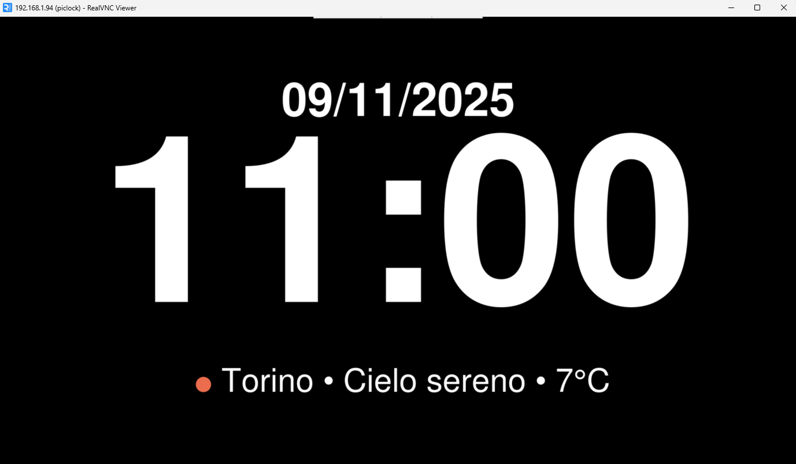

# Raspberry Pi Clock & Weather

A fullscreen weather and clock display for Raspberry Pi using Tkinter and OpenWeatherMap.



---

## Features
- Fullscreen digital clock with date  
- Real-time weather data and icon  
- Dynamic color transitions (day/night)  
- Smooth color fade effects  
- Automatic night mode (22:30–07:30)

---

## Requirements
Install required dependencies:
```bash
sudo apt update
sudo apt install -y python3 python3-pil python3-requests python3-tk git
```
---

## Installation

Clone the repository
```bash
git clone https://github.com/InitialDeu/raspberrypiclockweather.git
cd raspberrypiclockweather
```
Configure your city and API key
Edit the script to set your location and OpenWeatherMap key:

```bash
nano display_clock_weather.py
```

Change these lines:

```python
CITY = "YourCity"
API_KEY = "YourOpenWeatherAPIKey"
```
You can get a free API key here: https://openweathermap.org/api

Run manually (test)
```bash
python3 display_clock_weather.py
```

If everything is correct, you’ll see the fullscreen clock and weather on your HDMI display.

Autostart on boot (systemd)
To automatically start the display after boot, use the included service file.

Create or edit:

```bash
sudo nano /etc/systemd/system/clockweather.service
```

Paste this:
```ini
[Unit]
Description=Raspberry Pi Clock & Weather
After=network-online.target
Wants=network-online.target

[Service]
Type=simple
User=pi
WorkingDirectory=/opt/raspberrypiclockweather
ExecStart=/usr/bin/python3 /opt/raspberrypiclockweather/display_clock_weather.py
Restart=always
Environment="DISPLAY=:0"
Environment="XAUTHORITY=/home/pi/.Xauthority"
Environment="XDG_RUNTIME_DIR=/run/user/%U"

[Install]
WantedBy=graphical.target
```
Then enable it:

```bash
sudo systemctl daemon-reload
sudo systemctl enable --now clockweather
```

Check status:

```bash
sudo systemctl status clockweather
```

To stop or restart:

```bash
sudo systemctl stop clockweather
sudo systemctl restart clockweather
```
---

## Quick Install (One Command)

You can automate everything (install, clone, setup, and service) with the script below.

Copy and paste it directly into your terminal on your Raspberry Pi.

```bash
#!/bin/bash
# Raspberry Pi Clock & Weather - Quick Installer
# Author: InitialDeu
# License: GPL

set -e

INSTALL_DIR="/opt/raspberrypiclockweather"
SERVICE_NAME="clockweather.service"

echo "Installing Raspberry Pi Clock & Weather..."
sudo apt update -y
sudo apt install -y python3 python3-pil python3-requests python3-tk git

if [ ! -d "$INSTALL_DIR" ]; then
    sudo git clone https://github.com/InitialDeu/raspberrypiclockweather.git "$INSTALL_DIR"
else
    echo "Repository already exists, updating..."
    cd "$INSTALL_DIR" && sudo git pull
fi

echo "Installing systemd service..."
sudo bash -c "cat > /etc/systemd/system/$SERVICE_NAME" <<'EOF'
[Unit]
Description=Raspberry Pi Clock & Weather
After=network-online.target
Wants=network-online.target

[Service]
Type=simple
User=pi
WorkingDirectory=/opt/raspberrypiclockweather
ExecStart=/usr/bin/python3 /opt/raspberrypiclockweather/display_clock_weather.py
Restart=always
Environment="DISPLAY=:0"
Environment="XAUTHORITY=/home/pi/.Xauthority"
Environment="XDG_RUNTIME_DIR=/run/user/%U"

[Install]
WantedBy=graphical.target
EOF

sudo systemctl daemon-reload
sudo systemctl enable --now clockweather

echo ""
echo "Installation complete!"
echo "Use 'sudo systemctl status clockweather' to check status."
echo "Use 'journalctl -u clockweather -f' to view logs."
```

Make it executable (if saved separately):

```bash
chmod +x quick-install.sh
```
Run it:

```bash
./quick-install.sh
```
---

## Notes
Tested on Raspberry Pi OS (Bookworm) with X11 desktop session

Works best with HDMI display (detected as HDMI-1)

Requires active internet connection for weather updates

Screen automatically dims between 22:30 and 07:30

---

## Author
Developed by InitialDeu
Feel free to fork, improve, and contribute.

## License
This project is released under the GPL License.
